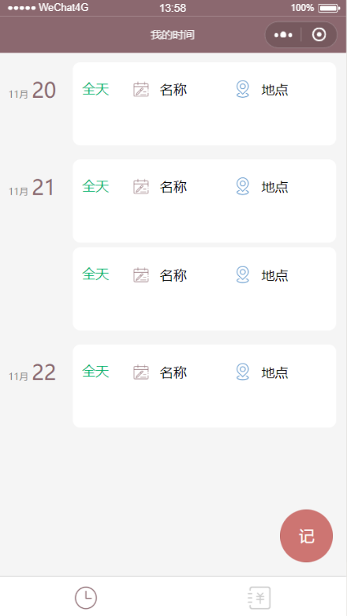
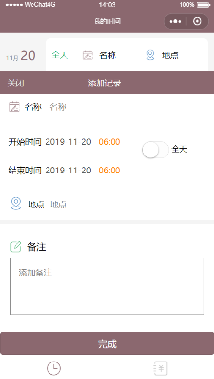
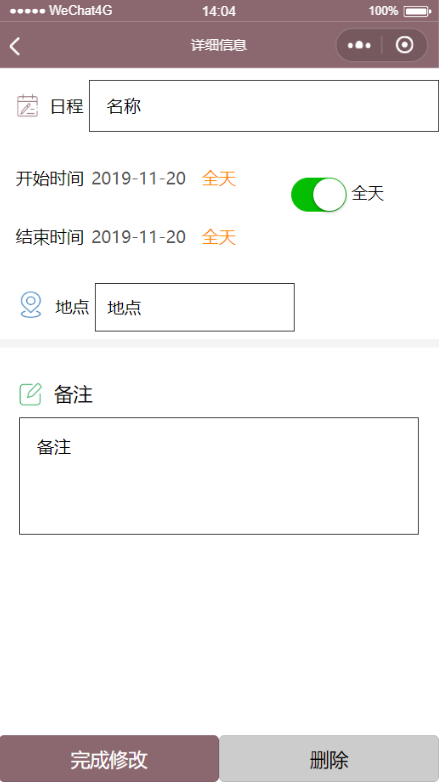
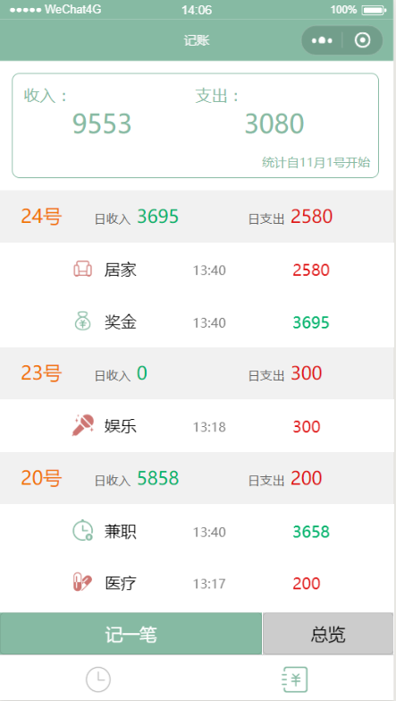
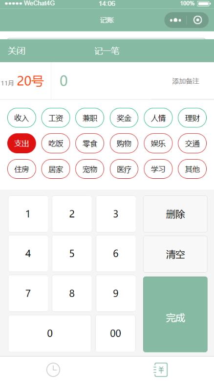
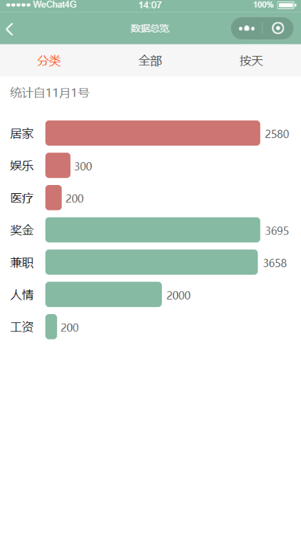

# schedule 时间管理

- 时间表总览
- 添加记录
- 行程详情页

# account 记账

- 账本总览
- 记一笔
- 数据总览页

# 微信云开发
1. 数据库：一个既可在小程序前端操作，也能在云函数中读写的 JSON 文档型数据库
2. 文件存储：在小程序前端直接上传/下载云端文件，在云开发控制台可视化管理
3. 云函数：在云端运行的代码，微信私有协议天然鉴权，开发者只需编写业务逻辑代码